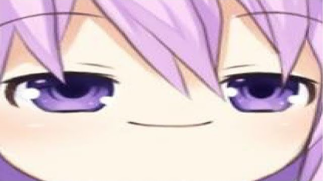
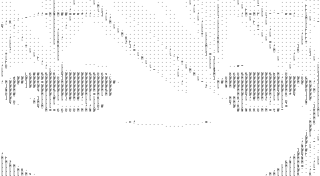
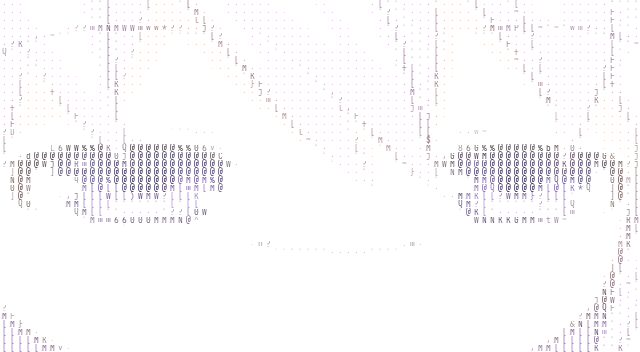
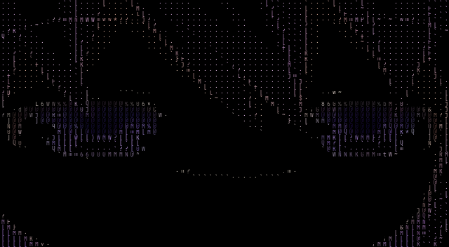
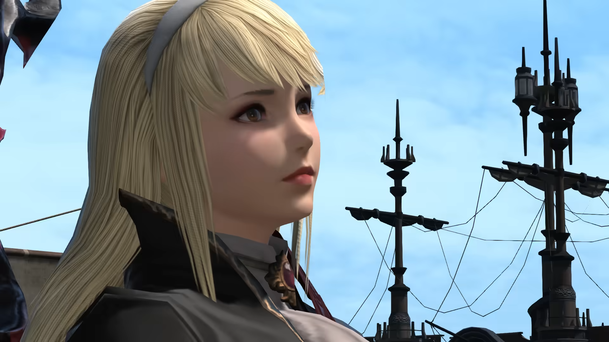
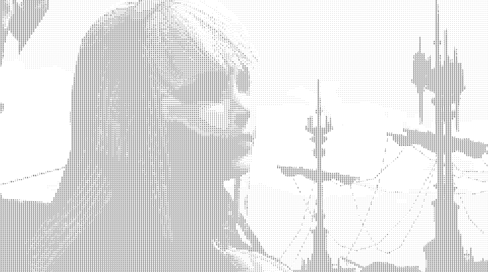
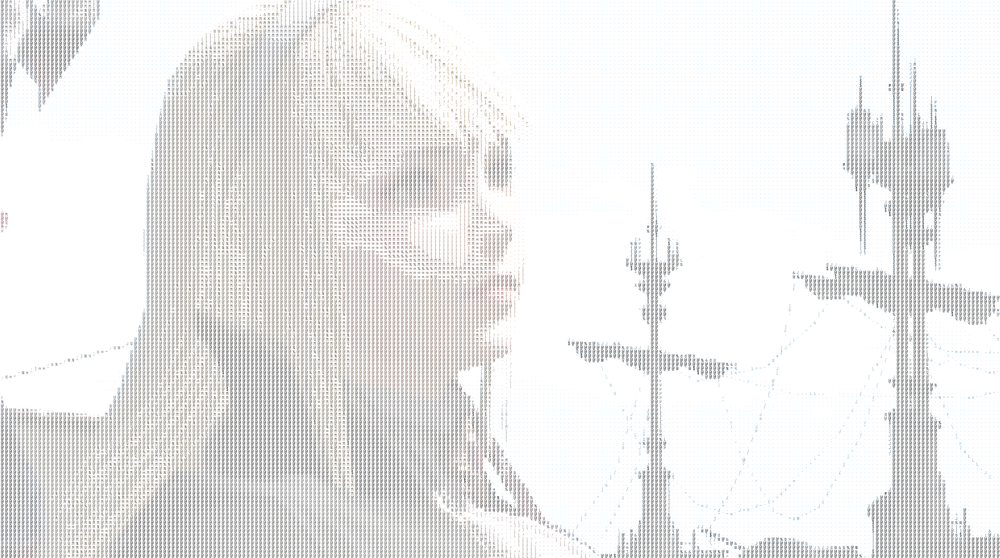
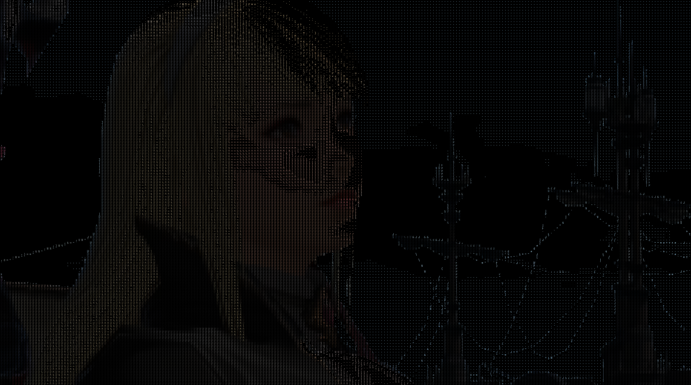

# Acerola-Inspired Ascii Art Generator

After recently watching a video by [Acerola](https://www.youtube.com/@Acerola_t) about shader based ascii art, I was inspired to create my own version of an ascii art generator.

[](https://www.youtube.com/watch?v=gg40RWiaHRY)

One thing that I noticed was a majority of ascii art generators (at least that I have come across) essentially work by quantizing the image, then using the value as an index to a character set.

This is a simplistic method, but it doesn't capture that 'hand-crafted' ASCII art feel effectively. The method that Acerola used was to use more shader-based principles and methods such as Difference of Gaussians and Sobel filters to provide edge detection and more detailed ascii art... yet it still more or less uses the same quantization method.

Instead I decided to create a simple algorithm that would consider the font being used. The idea is to take a font, and a range of characters, rasterize them to determine a density map of each character, then when splitting an image to convert into 8x8 quadrants, we perform shape matching to determine the best character to use. This means if our segment has a lot of white space at the top, but not much at the bottom, the algorithm would hopefully choose a character that could effectively represent this.

For now, this does not have any edge detection as in the original video, but that would be an interesting addition to make in the future to really sell the effect.

Another thing to consider is how we can extract more information before that quantization step where we lose a lot of detail. Again, for now, this is not implemented and we just use a simplistic sum of differences calculation, at least for colorization, but this could be improved in the future.

## Examples

For each input image, we generated four outputs. The first is the text generated by the script. The second uses maps the characters to their rasterized binary data to generate an exact image representation of the underlying logic being performed. The third and fourth have colorization, with the third using a white background and colored foreground, and the fourth using a black background and colored foreground.

### Example 1

| Input | Output | Rasterized | Colorized (White Background) | Colorized (Black Background) |
| --- | --- | --- | --- | --- |
|  | [Example 1 Output](examples/example1/output.txt) |  |  |  |

### Example 2

| Input | Output | Rasterized | Colorized (White Background) | Colorized (Black Background) |
| --- | --- | --- | --- | --- |
|  | [Example 2 Output](examples/example2/output.txt) |  |  |  |

## Usage

To use the script, you can run the following commands within the `src` directory:

1. Generate the rasterized font data:

```bash
python3 rasterFont.py --font JetBrainsMono.ttf --charset printable_ascii --output_size 8 8 --output_dir output/ --antialias
```

Take note of the output directory, as you will need to use this in the next step.

2. Generate the ascii art:

(Text Only)

```bash
python3 makeAsciiArt.py --image input.png --dat_dir output/ --output_size 8 8 --output_file output.txt --metric sad
```

(B/W Rasterized)

```bash
python3 makeAsciiArt.py --image input.png --dat_dir output/ --output_size 8 8 --output_file output.txt --metric sad --output_image output.png
```

(Colorized, White Background)

```bash
python3 makeAsciiArt.py --image input.png --dat_dir output/ --output_size 8 8 --output_file output.txt --metric sad --output_image output.png --color_mode avg --bg_color FFFFFFFF
```

(Colorized, Black Background)

```bash
python3 makeAsciiArt.py --image input.png --dat_dir output/ --output_size 8 8 --output_file output.txt --metric sad --output_image output.png --color_mode avg --bg_color 000000FF
```

## Future Work

There are a few things that could be improved in the future:

1. Implement edge detection to improve the quality of the ascii art.
2. Add more shape matching metrics for determining the best character to use.
3. Add more color metrics for determining the best color to use.
4. Improve the rasterization process to extract more information before quantization.
5. Speed up the process by using more efficient algorithms and data structures (currently KMeans color matching is unusable for large images due to the time complexity of the algorithm. There are some low lying fruit optimizations that could be made here, but I don't have the time to implement them right now).
6. General code cleanup and refactoring.
7. Add graphical user interface for ease of use.
8. Add more examples to the README.

## Credits

Credit to [Acerola](https://www.youtube.com/@Acerola_t) for the inspiration. Check out their video for a much better final product than what I have here. This was just a 'low lying fruit' bonus that I think could be implemented into their shaders to greatly improve the quality of the ascii art without too much additional effort (as font information can be prebatched and stored in a texture, and the shape matching can be done in a compute shader, etc.)

Credits also to [JetBrains Mono](https://www.jetbrains.com/lp/mono/) for the open source font used in the examples. All rights to the font belong to their respective owners. The JetBrains Mono typeface is available under the [OFL-1.1 License](https://github.com/JetBrains/JetBrainsMono/blob/master/OFL.txt), and is used here for educational purposes.
